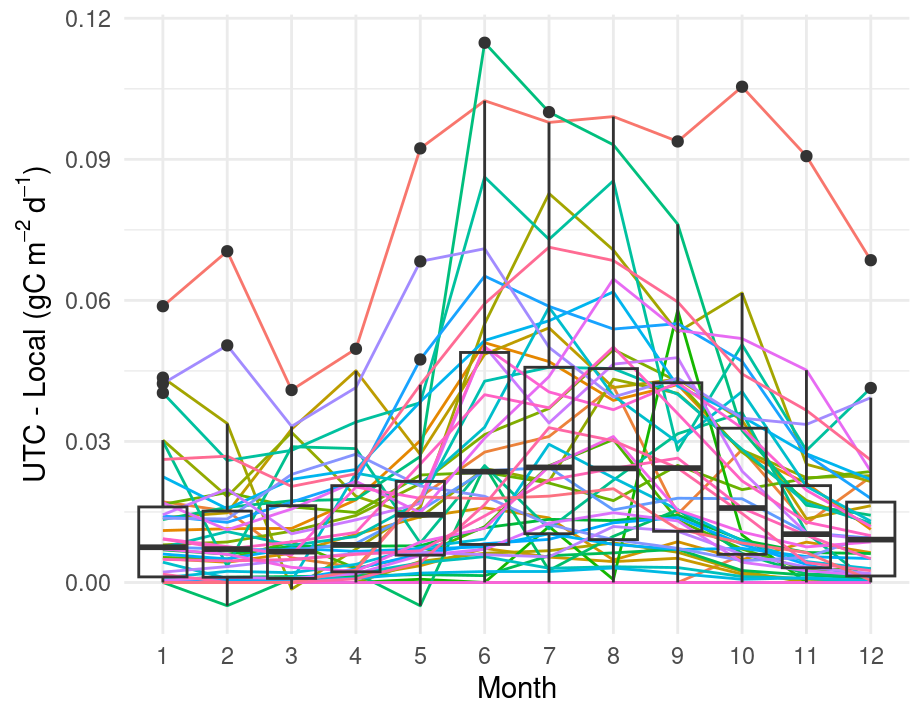

# Technical notes on soilflux4cast

## Time interval

- Environmental drivers: 00 UTC
- Fluxes: Daily

## Environmental drivers

We use a direct access to the NOAA Global Ensemble Forecasting System
through the `gefs4cast` package LINK. Site specific biases range from 0
for soil water and 5 degrees Celsius for soil temperature (see figure
below)

In addition, the comparison between measured surface temperature and
soil water from the most shallow sites at shows good convergence between
soil temperature (using the 00 UTC values for both NEON and GEFS), but
less so for soil water, expressed in the following Taylor diagram.

A Taylor diagram is displayed on a polar coordinate plot with the radius
equal to the standard deviation of a measurement from NEON. The
horizontal axis of the Taylor diagram contains the standard deviation of
the a measurement from NEON. The azimuthal angle in the Taylor diagram
is the correlation coefficient *r* between the GEFS and NEON. In
addition, the centered root mean square difference between the two
datasets values can be inferred with isoclines that are concentric
circles centered at the reference standard deviation. For ease of
comparison with several different sites, the quantities shown on a
Taylor diagram are normalised by the reference standard deviation.
Different colors represent a NEON site, shapes the averaging period (00
or across the entire day).

## Flux averaging period

We compared the differences in fluxes averaged over a UTC day, compared
to the local time. Because of seasonality we compare each NEON site each
month

