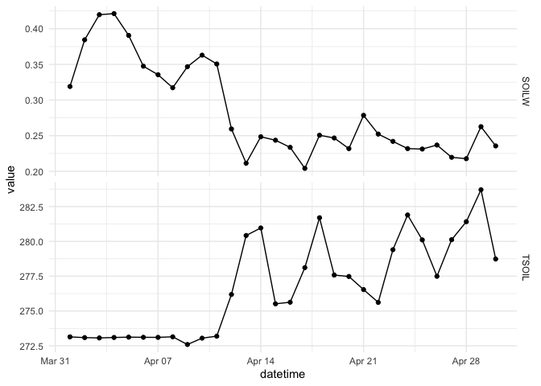
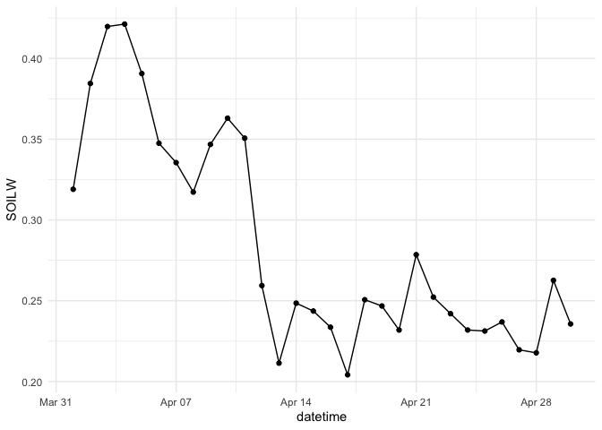
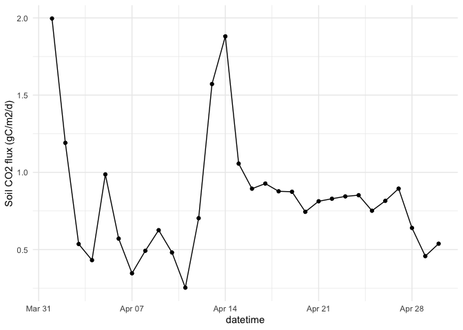
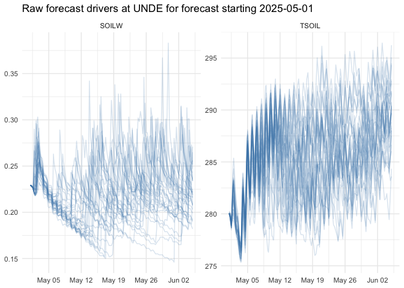
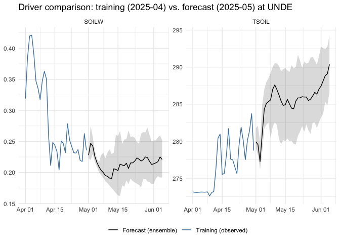
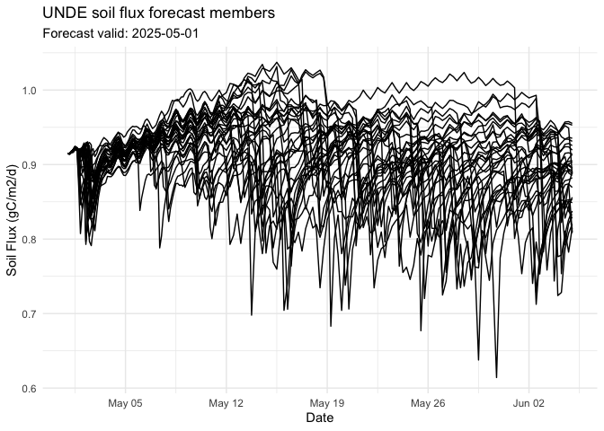
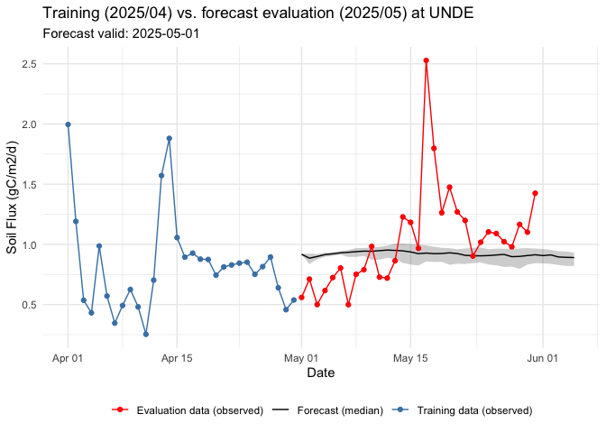
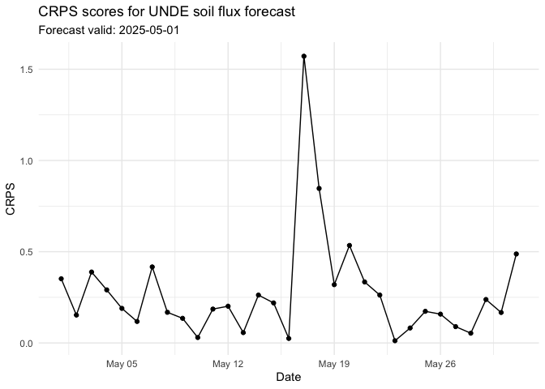

# Introduction to soil flux forecasting - scaffolded (guided tutorial)
John Zobitz

# Theme: Soil fluxes

- **What:** Soil fluxes of carbon (gC m<sup>-2</sup> d<sup>-1</sup>)
  derived from Fick’s Law of diffusion.
- **Where:** 47 terrestrial NEON sites that span the diverse ecosystems
  of the U.S.
- **When:** Daily forecasts for at least 30-days in the future are
  accepted at any time. The only requirement is that submissions are
  predictions of the future at the time the forecast is submitted.
- **Why:** Soils are one of the largest pools of terrestrial carbon.

## Prerequisites

This module assumes you:

1.  Know what an ecological forecast is.
2.  Have worked in developing forecasts and evaluating forecasts.
3.  Have an emerging understanding of soil carbon fluxes are and know
    what the National Ecological Observatory Network (NEON) is.
4.  Have experience working with `R` and `tidyverse`.

This tutorial utilizes the [`soilflux4cast` github
repository](https://github.com/jmzobitz/soilflux4cast), which I
anticipate developing further into a standalone `R` package.

### Libraries

To run this tutorial you will need the following R packages / libraries
and where they are utilized in the `soilflux4cast` functions:

- `tidyverse` (data wrangling)
- `jsonlite` (accessing github files)
- `devtools` (sourcing from a github repo)
- `glue` (file name pasting)
- `arrow` (file storage)
- `terra` (downloading forecasts)
- `sf` (downloading forecasts)

As a reminder, if you need to install packages into your `R` library,
use `install.packages("PACKAGE_NAME")` at the command line.

## About `soilflux4cast`

The [`soilflux4cast` github
repository](https://github.com/jmzobitz/soilflux4cast) provides the
following:

- **Drivers**: historical soil environmental driver data at each of the
  47 terrestrial NEON sites. These data are used for forecast
  parameterization. Historical driver data for the previous month are
  computed at the start of each month using a github action. Extends
  from 2022-01 to present. Stored as `csv` files.
- **Targets**: historical daily average soil fluxes at each of the
  terrestrial NEON sites. Computed with a github action on the 15th of
  each month, following a provisional NEON data release. Extends from
  2017-01 to present. Stored as `csv` files.

## Preliminaries

This tutorial requires the following packages installed on your local
`R` installation. We may not use all of the libraries in the examples
below - but some libraries are embedded within functions in
`soilflux4cast` that you will be using:

``` r
# load up the packages
library(tidyverse) # data wrangling
library(jsonlite) # accessing github files
library(devtools) # sourcing from a github repo
library(glue) # file name pasting
library(arrow) # file storage
library(terra) # downloading forecasts
library(sf) # downloading forecasts
```

Run the following code to acquire the locally store functions that will
allow you to acquire driver and target data:

``` r
# Helper function to source from your specific repo
source_github <- function(file_name) {
  base_url <- "https://raw.githubusercontent.com/jmzobitz/soilflux4cast/main/"
  devtools::source_url(paste0(base_url, file_name))
}

# Now you can source any file by name
source_github("R/download_values.R")
source_github("R/noaa_soil_drivers.R")
```

## Drivers

Driver variables are provided by NOAA’s Global Ensemble Forecasting
System, acquired through the [`gefs4cast` github
repository](https://github.com/eco4cast/gefs4cast). Notably for this
project, we have pre-selected NOAA GEFS [driver
variables](https://www.nco.ncep.noaa.gov/pmb/products/gens/gec00.t00z.pgrb2a.0p50.f000.shtml)
that are known to influence soil surface fluxes:

- `PRES`: Surface Pressure \[Pa\]
- `TSOIL`: Soil Temperature 0-0.1 m below ground \[K\]
- `SOILW`: Volumetric Soil Moisture Content 0-0.1 m below ground
  \[Fraction\]
- `WEASD`: Water Equivalent of Accumulated Snow Depth \[kg/m^2\]
- `SNOD`: Snow Depth \[m\]
- `ICETK`: Ice Thickness \[m\]

If you would like additional variables included, please file a [github
issue](https://github.com/jmzobitz/soilflux4cast/issues).

### Historical (Stage 3) drivers

The function `download_values` is used to acquire across all terrestrial
NEON sites. For example to get the drivers from April 2025:

``` r
download_values(
  variable = "drivers", # environmental variables
  year = "2025",
  month = "04" # optional - you can omit if you want values for the entire year
) |>
  dplyr::glimpse()
```

The output has the following variables:

- `site_id`: string : NEON site ID
- `datetime`: timestamp\[us, tz=UTC\]: datetime of forecast
- `PRES`: prediction of Surface Pressure \[Pa\]
- `TSOIL`: prediction of Soil Temperature 0-0.1 m below ground \[K\]
- `SOILW`: prediction of Volumetric Soil Moisture Content 0-0.1 m below
  ground \[Fraction\]
- `WEASD`: prediction of Water Equivalent of Accumulated Snow Depth
  \[kg/m^2\]
- `SNOD`: prediction of Snow Depth \[m\]
- `ICETK`: prediction of Ice Thickness \[m\]

The output from `download_values` is similar to the
`neon4cast::noaa_stage3()` function for the [NEON Ecological Forecasting
challenges](https://projects.ecoforecast.org/neon4cast-docs/Shared-Forecast-Drivers.html#stage-3).
These observed values are computed at the beginning of a calendar month
and stored in the `soilflux4cast` github through github actions.

### Ensemble forecasts for driver vairables (Stage 1)

For a single forecast date, we provide ensemble forecasts for each of
the driver variables listed above at each of the terrestrial NEON sites.
At each site, 31 ensemble member forecasts are provided at 3 hr
intervals for the first 10 days, and 6 hr intervals for up to 35 days
(840 hr horizon) using the function `noaa_soil_drivers`for a given
forecast date:

``` r
noaa_soil_drivers(
  forecast_date = "2025-05-01",
  # site = 'UNDE'   # optional to specify a given NEON site
) |>
  dplyr::glimpse()
```

An optional input `site` will only acquire forecasts at a given
terrestrial NEON site, which can speed time up.

The output has the following variables:

- `ensemble`: int32 : ensemble member number
- `cycle`: string: hour of day that forecast was started
- `horizon`: double : number of seconds in the future
- `datetime`: timestamp\[us, tz=UTC\]: datetime of forecast
- `family`: string: class of uncertainty (ensemble)
- `site_id`: string : NEON site ID
- `PRES`: prediction of Surface Pressure \[Pa\]
- `TSOIL`: prediction of Soil Temperature 0-0.1 m below ground \[K\]
- `SOILW`: prediction of Volumetric Soil Moisture Content 0-0.1 m below
  ground \[Fraction\]
- `WEASD`: prediction of Water Equivalent of Accumulated Snow Depth
  \[kg/m^2\]
- `SNOD`: prediction of Snow Depth \[m\]
- `ICETK`: prediction of Ice Thickness \[m\]

The output from `noaa_soil_drivers` is analgous to the
`neon4cast::noaa_stage3()` function for the [NEON Ecological Forecasting
challenges](https://projects.ecoforecast.org/neon4cast-docs/Shared-Forecast-Drivers.html#stage-1).
Other aboveground driver variables are available through the
[`neon4cast`
package](https://projects.ecoforecast.org/neon4cast-docs/Shared-Forecast-Drivers.html).

## Targets

The target is a daily total soil flux of carbon (gC m<sup>-2</sup>
d<sup>-1</sup>) derived from half-hourly computed soil carbon fluxes
with the [`neonSoilFlux` `R`
package](https://cran.r-project.org/web/packages/neonSoilFlux/index.html)
and associated publication
[LINK](https://besjournals.onlinelibrary.wiley.com/doi/10.1111/2041-210x.70216).

These targets are also accessible through the `download_values`
function:

``` r
download_values(
  variable = "targets",
  year = "2025",
  month = "04" # optional - you can omit if you want values for the entire year
) |>
  dplyr::glimpse()
```

The output has the following variables:

- `site_id`: string : NEON site ID
- `datetime`: timestamp\[us, tz=UTC\]: datetime of forecast
- `flux`: daily soil carbon flux \[gC/m2/d\]
- `flux_err`: daily soil carbon flux uncertainty \[gC/m2/d\]

Now you are ready to develop a model and forecast!

## Case study: construcing an empirical model at a NEON site

Let’s develop a simple forecast using a linear model with environmental
covariates from a NEON Site.

We will parameterize a model to predict soil fluxes using simple linear
regression. The model will have the form
$R_{S} = a_{0} + a_{1} T_{S} + a_{2} SOILW$, where $R_{S}$ is soil flux,
$T_{S}$ is soil temperature, $SOILW$ soil water content.

First let’s acquire the driver variables to see what soil flux is like
at the [NEON UNDE](https://www.neonscience.org/field-sites/unde) site in
April 2024. We’ll use the `dplyr` function `filter` to just examine the
data at UNDE.

``` r
drivers <- download_values(
  variable = "drivers",
  year = "2025",
  month = "04" # optional - you can omit if you want values for the entire year
)

# Get drivers for UNDE site:
unde_drivers <- drivers |>
  filter(site_id == "UNDE") |>
  select(site_id, datetime, TSOIL, SOILW)

# Plot the drivers separately.

# Note that TSOIL is in Kelvin
unde_drivers |>
  ggplot(aes(x = datetime, y = TSOIL)) +
  geom_line() +
  geom_point() +
  theme_minimal()
```



``` r
unde_drivers |>
  ggplot(aes(x = datetime, y = SOILW)) +
  geom_line() +
  geom_point() +
  theme_minimal()
```



Next let’s take a look at the targets across this same time frame:

``` r
### Acquire targets for April 2024.
targets <- download_values(
  variable = "targets",
  year = "2025",
  month = "04" # optional - you can omit if you want values for the entire year
)

# Filter the targets so you have just the UNDE NEON site:
unde_targets <- targets |>
  filter(site_id == "UNDE")

unde_targets |>
  ggplot(aes(x = datetime, y = flux)) +
  geom_line() +
  geom_point() +
  ylab("Soil CO2 flux (gC/m2/d)") +
  theme_minimal()
```



To parameterize the model will require some data wrangling, first by
joining the drivers and targets together.

``` r
# Join the targets and drivers together
joined_unde <- unde_targets |>
  inner_join(unde_drivers, by = c("site_id", "datetime")) |>
  drop_na() # Remove any NA values to avoid errors when fitting.

# Compute the model
lm_fit <- lm(flux ~ SOILW + TSOIL, data = joined_unde) # Parameterize the model
coeff <- lm_fit |> broom::tidy() # Extract the coefficients
sigma <- sd(lm_fit$residuals) # Our modeling error
```

Now let’s make a prediction for the next day with our forecast. First
let’s get our forecast drivers and plot those:

``` r
# Acquire the drivers for May 1.
fx_drivers_unde <- noaa_soil_drivers(
  forecast_date = "2025-05-01",
  site = "UNDE"
)

fx_drivers_unde |>
  pivot_longer(cols = c("TSOIL", "SOILW"), names_to = "variable") |>
  ggplot(aes(x = datetime, y = value, group = ensemble)) +
  geom_line(alpha = 0.2, color = "steelblue") +
  facet_wrap(~variable, scales = "free_y", ncol = 2) +
  theme_minimal() +
  labs(
    title = "Raw forecast drivers at UNDE for forecast starting 2025-05-01",
    x = NULL, y = NULL
  )
```



It may be better to show a confidence interval rather than each ensmeble
member. We will need to do some data wrangling to get the average soil
temperature and soil water each day with the following workflow:

1.  Use `floor_date` to determine each day (as a categorical variable)
2.  For each day, compute the the 10%, 50%, and 90% percential across
    each environmental driver.
3.  Pivot into a tall data table for easier plotting.

``` r
fx_drivers_unde_day <- fx_drivers_unde |>
  mutate(datetime = floor_date(datetime, unit = "day")) |>
  group_by(datetime) |>
  summarize(
    across(
      c("TSOIL", "SOILW"),
      list(
        q10  = ~ quantile(.x, 0.10, na.rm = TRUE),
        q50  = ~ quantile(.x, 0.50, na.rm = TRUE),
        q90  = ~ quantile(.x, 0.90, na.rm = TRUE)
      ),
      .names = "{.col}___{.fn}"
    ),
    .groups = "drop"
  ) |>
  pivot_longer(
    cols = -datetime,
    names_to = c("variable", ".value"),
    names_sep = "___"
  ) |>
  mutate(period = "Forecast (ensemble)")
```

Now we will the drivers used to parameterize the model with the ensemble
from the forecast drivers:

``` r
unde_drivers_long <- unde_drivers |>
  pivot_longer(
    cols = c("TSOIL", "SOILW"),
    names_to = "variable",
    values_to = "q50"
  ) |>
  mutate(period = "Training (observed)")

ggplot() +
  geom_ribbon(
    data = fx_drivers_unde_day,
    aes(x = datetime, ymin = q10, ymax = q90),
    fill = "black", alpha = 0.15
  ) +
  geom_line(data = unde_drivers_long, aes(x = datetime, y = q50, color = period)) +
  geom_line(data = fx_drivers_unde_day, aes(x = datetime, y = q50, color = period)) +
  scale_color_manual(
    name = NULL,
    values = c("Training (observed)" = "steelblue", "Forecast (ensemble)" = "black")
  ) +
  facet_wrap(~variable, scales = "free_y", ncol = 2) +
  theme_minimal() +
  theme(legend.position = "bottom") +
  labs(
    title = "Driver comparison: training (2025-04) vs. forecast (2025-05) at UNDE",
    x = NULL, y = NULL
  )
```



Similarly, we will use each of the ensemble members to forecast soil
flux one month ahead.

``` r
# Now we are ready to predict with these forecast drivers
# Create prediction matrix (include intercept by adding a column of 1)

X <- model.matrix(~ 1 + SOILW + TSOIL, data = fx_drivers_unde)

# Set the model coefficients as a vector so we can predict.
coeff_vec <- coeff |>
  select(term, estimate) |>
  deframe()

# Calculate the predicted forecasts
fx_unde_out <- fx_drivers_unde |>
  mutate(prediction = ((X %*% coeff_vec) |>
    as.numeric()))
```

How did the forecasts do? Let’s take a look:

``` r
fx_unde_out |>
  ggplot(aes(x = datetime, y = prediction, group = ensemble)) +
  geom_line() +
  theme_minimal() +
  labs(
    title = "UNDE soil flux forecast members",
    subtitle = "Forecast valid: 2025-05-01",
    x = "Date",
    y = "Soil Flux (gC/m2/d)"
  )
```



As expected, the forecast ensemble increases the further we are from the
forecast date.

How did our forecast perform? Because we did a hindcast, we can evaluate
the performance of the forecast:

``` r
### Acquire targets for comparison (for the next month)
targets_eval <- download_values(
  variable = "targets",
  year = "2025",
  month = "05" # optional - you can omit if you want values for the entire year
)

# Just get the UNDE site
unde_targets_eval <- targets_eval |>
  filter(site_id == "UNDE")
```

Simliar to what we did with the drivers, let’s compare the following:

- Observed soil flux in 2025-04 that was used to parametertize our
  model.
- Ensemble average of our soil flux forecasts.
- Observed soil flux in 2025-05 for comparison.

The following is a long `ggplot` code string, but it helps to put this
all together.

``` r
# Compute the average ensemble values
fx_unde_out_day <- fx_unde_out |>
  mutate(datetime = floor_date(datetime, unit = "day")) |>
  group_by(datetime) |>
  summarize(
    across(
      c("prediction"),
      list(
        q10  = ~ quantile(prediction, 0.10, na.rm = TRUE),
        q50  = ~ quantile(prediction, 0.50, na.rm = TRUE),
        q90  = ~ quantile(prediction, 0.90, na.rm = TRUE)
      ),
      .names = "{.col}_{.fn}"
    ),
    .groups = "drop"
  ) |>
  mutate(period = "Forecast (ensemble)")

# Now plot!
ggplot() +
  geom_ribbon(
    data = fx_unde_out_day,
    aes(x = datetime, ymin = prediction_q10, ymax = prediction_q90),
    fill = "black", alpha = 0.2
  ) +
  geom_line(data = fx_unde_out_day, aes(x = datetime, y = prediction_q50, color = "Forecast (median)")) +
  geom_point(data = unde_targets, aes(x = datetime, y = flux, color = "Training data (observed)")) +
  geom_line(data = unde_targets, aes(x = datetime, y = flux, color = "Training data (observed)")) +
  geom_point(data = unde_targets_eval, aes(x = datetime, y = flux, color = "Evaluation data (observed)")) +
  geom_line(data = unde_targets_eval, aes(x = datetime, y = flux, color = "Evaluation data (observed)")) +
  scale_color_manual(
    name = NULL,
    values = c(
      "Training data (observed)" = "steelblue",
      "Forecast (median)" = "black",
      "Evaluation data (observed)" = "red"
    )
  ) +
  theme_minimal() +
  theme(legend.position = "bottom") +
  xlab("Date") +
  ylab("Soil Flux (gC/m2/d)") +
  labs(
    x = "Date",
    y = "Soil Flux (gC/m2/d)",
    title = "Training (2025/04) vs. forecast evaluation (2025/05) at UNDE",
    subtitle = "Forecast valid: 2025-05-01"
  )
```



### Model evaluation

How well did our model do? Some forecast evaluation metrics are: The
following processing pipeline:

1.  Groups the forecasts by `datetime` and `site_id`
2.  Joins to the measured targets from that month.
3.  Computes the [Continuous Rank Probability Score
    (CRPS)](https://projects.ecoforecast.org/neon4cast-docs/Evaluation.html)
    from the `scoringRules` package (because we have an ensemble).
4.  Computes other summary statistics of the ensemble.

The following code will Report the percentage of predictions that fell
within the 90% CI (reliability):

``` r
# Nest by the day and site, join the measured targets, and then compute the crps and summary statistics

# Since we are doing an ensemble
fx_unde_summary <- fx_unde_out |>
  mutate(datetime = floor_date(datetime, unit = "day")) |>
  group_by(datetime, site_id) |>
  nest() |>
  inner_join(unde_targets_eval, by = c("datetime", "site_id")) |>
  mutate(
    crps = map2_dbl(.x = flux, .y = data, .f = ~ scoringRules::crps_sample(.x, .y$prediction)),
    summary_stats = map(.x = data, .f = ~ (
      .x |> reframe(
        value = stats::quantile(prediction, na.rm = TRUE, probs = c(0.025, 0.10, 0.5, 0.9, .975)),
        name = c("prediction_q0.025", "prediction_q0.10", "prediction_q0.5", "prediction_q0.90", "prediction_q0.975"),
        prediction_mean = mean(prediction, na.rm = TRUE),
        prediction_sd = sd(prediction, na.rm = TRUE)
      ) |>
        tidyr::pivot_wider()
    ))
  ) |>
  select(-data) |>
  unnest(cols = c(summary_stats)) |>
  mutate(within_TRUE = between(flux, prediction_q0.10, prediction_q0.90)) |>
  ungroup()

# Report the percentage of predictions that fell within the 90% CI (reliability):
fx_unde_summary |>
  summarize(reliability = mean(within_TRUE))
```

    # A tibble: 1 × 1
      reliability
            <dbl>
    1      0.0645

``` r
# Plot the CRPS over time
ggplot(
  data = fx_unde_summary,
  aes(x = datetime, y = crps)
) +
  geom_point() +
  geom_line() +
  theme_minimal() +
  labs(
    x = "Date",
    y = "CRPS",
    title = "CRPS scores for UNDE soil flux forecast",
    subtitle = "Forecast valid: 2025-05-01"
  )
```



Clearly this is poorly calibrated, overconfident forecast! The
reliability (percentage of observations within the 90% confidence
interval) is quite low.

Now let’s plot our forecast, the 90% confidence interval, with the
observations:

## Follow on steps

- This forecast just ran at one site. Can you use iteration techniques
  (i.e. `purrr::map`) to iterate across several sites?
- Can you try an alternative model? What if you parameterized data from
  the entire previous year (2024), rather than one month previously?
- Are there alternative models better than linear regression?
- What if you computed one-day out forecasts for each day of the month?

## Submitting forecasts

I invite you to participate in this forecasting challenge. All modeling
approaches are welcome. Here are the steps needed to participate:

1.  Generate a forecast!
2.  Write the forecast output to a file that follows the [standardized
    format for the NEON EFI forecast
    challenge](https://projects.ecoforecast.org/neon4cast-ci/instructions.html#submission-process):
    `soil_flux-year-month-day-model_id.csv`. Compressed csv files with
    the csv.gz extension are also accepted. The year, month, and day are
    the year, month, and day the `reference_datetime` (`horizon = 0`).
3.  Submit your forecast to `zobitz@augsburg.edu` with the subject line
    soil_flux-year-month-day-model_id, along with an `R` function to run
    your forecast (if you want it to be automated)
4.  Register and describe your model here:
    [LINK](https://docs.google.com/forms/d/e/1FAIpQLScOnp6q5ODkPAIYplau-eWUE6mPEs4-9loMikOC6ugWgzGTkQ/viewform?usp=sharing&ouid=110173876465247112627).
    You are not required to register if your forecast submission uses
    the word “example” in your model_id”. Any forecasts with “example”
    in the model_id will not be used in forecast evaluation analyses.
    You can use neon4cast as the challenge for which you are
    registering.
5.  Watch your forecast be evaluated as new data are collected.

### Forecast standards

Once the forecast is created, we follow a similar standard for
submission of forecasts for the [NEON Ecological Forecasting
Challenge](https://projects.ecoforecast.org/neon4cast-ci/instructions.html#forecast-file-format):

- `project_id`: use soilflux4cast
- `model_id`: the short name of the model defined as the `model_id` in
  your registration. The `model_id` should have no spaces. model_id
  should reflect a method to forecast one or a set of target variables
  and must be unique to the neon4cast challenge.
- `datetime`: forecast timestamp. Format `%Y-%m-%d` with UTC as the time
  zone
- `reference_datetime`: The start of the forecast; this should be 0
  times steps in the future. There should only be one value of
  `reference_datetime` in the file. Format is `%Y-%m-%d` with UTC as the
  time zone.
- `duration`: the time-step of the forecast. Use the value of `P1D` for
  a daily forecast. Formatted as `ISO 8601` duration
- `site_id`: code for NEON site.
- `family` name of the probability distribution that is described by the
  parameter values in the parameter column (see
  [here](https://projects.ecoforecast.org/neon4cast-ci/instructions.html#representing-uncertainty)
  for accepted distribution). An `ensemble` forecast as a family of
  ensemble. See note
  [here](https://projects.ecoforecast.org/neon4cast-ci/instructions.html#ensemble-or-sample-forecast)
  about `family`.
- `parameter` the parameters for the distribution (see note
  [here](https://projects.ecoforecast.org/neon4cast-ci/instructions.html#parameteric-forecast)
  about the `parameter` column) or the number of the ensemble members.
  For example, the parameters for a normal distribution are called `mu`
  and `sigma`.
- `variable`: standardized variable name. For this, use ‘soil_flux’.
- `prediction`: forecasted value for the parameter in the parameter
  column

## Additional resources

While we have touched on some fundamental ways to start forecasting soil
fluxes, here as some additional resources to level up your knowledge:

### Soil fluxes

- [Modeling soil fluxes with NEON
  data](https://qubeshub.org/publications/4774/1)

### Data science skills

- [Modern Data Science with R](https://mdsr-book.github.io/mdsr3e/)
- [R for Data Science](https://r4ds.hadley.nz/)
- [Environmental Data Science](https://jmzobitz.github.io/eds-text/)
  *work in progress*

### Ecological forecasting

- [Introduction to ecological
  forecasting](https://serc.carleton.edu/eddie/teaching_materials/modules/module5.html)
- [Understanding uncertainty in ecological
  forecasts](https://serc.carleton.edu/eddie/teaching_materials/modules/module6.html)
- [Using data to understand ecological
  forecasts](https://serc.carleton.edu/eddie/teaching_materials/modules/module7.html)
- [A Practical Guide to Ecosystem
  Forecasting](https://frec-5174.github.io/eco4cast-in-R-book/)
