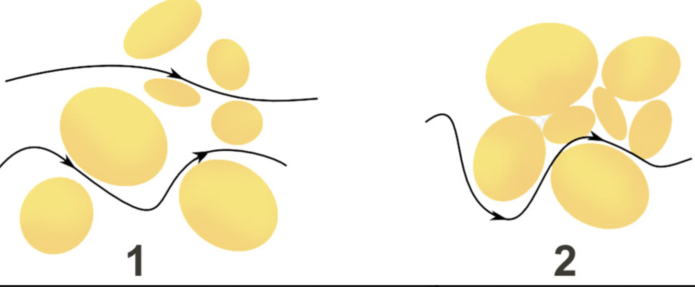
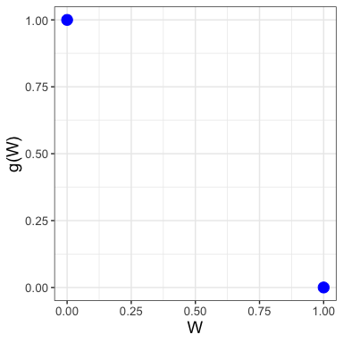
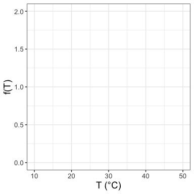
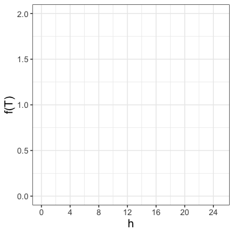
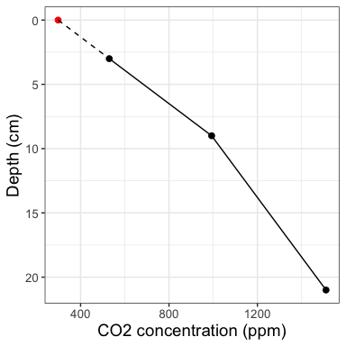
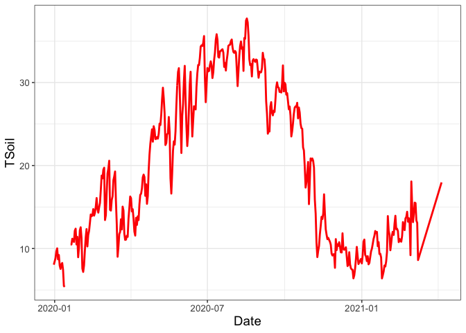
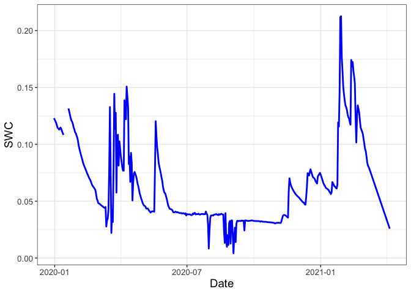

# Modeling Soil Fluxes with NEON Data
John M. Zobitz

**The learning outcomes of this activity are:**

- Understand the dynamic environmental and biological properties
  affecting soil CO$_{2}$ efflux.
- Apply Fick’s Law of Diffusion to estimate of soil gas efflux.
- Investigate a multi-year timeseries of soil water content, soil
  temperature, and soil gas efflux derived from Fick’s Law to infer
  process-level changes in soil CO$_{2}$ efflux.

Module citation: Zobitz (2024)

**Instructions:** Read carefully and in your groups *working together*
answer the numbered questions on your response paper. If you get stuck,
please ask!

# Introduction

The [global carbon
cycle](https://oceanservice.noaa.gov/facts/carbon-cycle.html) has many
different components, but of particular importance is the amount of
carbon in soils. Scientists believe soils have the largest reservoir of
carbon (Jobbágy and Jackson 2000). A key quantity is the soil carbon
flux, or the rate of change per unit area of the amount of carbon
leaving the soil and entering the atmosphere. This activity will guide
you through the measurements used to model and compute soil fluxes using
data collected from the National Ecological Observatory Network, or NEON
for short.

1.  Read more about NEON: [LINK](https://www.neonscience.org/about).
    After reviewing the information on this page, what did you wonder or
    notice? What would you like to know more about? **Please answer the
    question on the response sheet.**

2.  One site in NEON is the [San Joaquin Experimental
    Range](https://www.neonscience.org/field-sites/sjer) website and
    record three facts you find interesting or important. What
    scientific or ecological questions do you think could be studied
    here? **Please answer the question on the response sheet.**

# Fick’s law

We will denote the soil carbon flux as $F_{s}$, measured in $\mu$mol
m$^{-2}$ s$^{-1}$. The key equation to compute the soil flux at a given
location is **Fick’s law of Diffusion**:

The negative sign in Fick’s Law makes $F_{s}$ a positive value, which
means carbon is *leaving* the soil. The other terms are:

- $D_{a}$ is called the **diffusion coefficient** (units m$^{2}$
  s$^{-1}$). Values of $D_{a}$ also includes considerations for soil
  density and air pressure.
- $\displaystyle \frac{dC}{dz}$ is the (vertical) gradient in CO$_{2}$.
  We measure CO$_{2}$ in molar concentration (units $\mu$mol m$^{-3}$).
- The function $f(T)$ is a function that characterizes the temperature
  response $T$ (no units).
- The function $g(W)$ is a function that characterizes the response due
  to soil water content $W$ (no units).

We will investigate $f(T)$ and $g(W)$ separately below. Usually the
values of $f(T)$ and $g(W)$ range between 0 to 1, meaning they increase
or decrease the baseline value $D_{a}$ through a scaling factor.

## Dependence of Fick’s Law on soil water and temperature

### Understanding $g(W)$

Water in soils also reduces pore spaces (or *porosity*), which is
quantified by the *soil water content* or *W*. Soil water content is
measured on a scale between 0 to 1, where $W = 0$ means the soil is
completely dry, and $W = 1$ then soil is completely saturated.

See <a href="#fig-diffusion" class="quarto-xref">Figure 1</a> for a
conceptual diagram of this
[LINK](https://www.encyclopedie-environnement.org/en/zoom/diffusion-and-percolation-in-soils/).

3.  Based on this information, when soils are completely dry, we would
    expect **more / less** diffusion compared to when soils are
    completely wet. **Please circle the correct answer on the response
    sheet.**

We will consider the effect of $W$ on soil diffusion with a function
$g(W)$ that reduces diffusion by a proportional amount. One possibility
for $g(W)$ is:

- $g(W)=1$ when $W=0$ (meaning that there is no effect when soils are
  dry)
- $g(W)=0$ is when $W=1$ (meaning when soils are completely saturated
  there is no soil diffusion).

These two points are labeled in
<a href="#fig-grid-water" class="quarto-xref">Figure 2</a>.

4.  Let’s assume the function $g(W)$ is **linear**. Sketch a linear
    equation between the two points in
    <a href="#fig-grid-water" class="quarto-xref">Figure 2</a> for
    $0 \leq W \leq 1$. **Sketch the function on the grid in the response
    sheet.** Then determine the formula for the linear function $g(W)$
    on your response sheet, showing your work appropriately. **Please
    answer the question on the response sheet.**

Another possibility for the function $g(W)$, which represents the effect
of soil water on $D_{s}$. A possible equation for $g(W)$ is the
following (Moyano et al. 2012):

5.  Evaluate $g(W)$ for different values of $W$, filling in
    <a href="#tbl-water" class="quarto-xref">Table 1</a> below **on your
    response sheet**:

| $W$                | $0$ | $0.2$ | $0.4$ | $0.6$ | $0.8$ | $1$ |
|--------------------|-----|-------|-------|-------|-------|-----|
| $g(W)$ (linear)    |     |       |       |       |       |     |
| $g(W)$ (Equation ) |     |       |       |       |       |     |

6.  Use the information in
    <a href="#tbl-water" class="quarto-xref">Table 1</a> to add the
    Moyano model for $g(W)$ in
    <a href="#fig-grid-water" class="quarto-xref">Figure 2</a>. **Sketch
    the function on the grid in the response sheet.** What do you notice
    about the Moyano model in comparison to your linear model? **Please
    answer the question on the response sheet.**

7.  Using the information in
    <a href="#tbl-water" class="quarto-xref">Table 1</a> and
    <a href="#fig-grid-water" class="quarto-xref">Figure 2</a>, as $W$
    increases, compared to the linear model the Moyano model is more /
    less sensitive to changes in soil water content because the linear
    model for $g(W)$ is greater than / less than the Moyano model at the
    same value of $W$. **Please circle the correct answers on the
    response sheet.**

8.  Since $g(W)$ ultimately affects $D_{s}$, which in turn is directly
    proportional to $F_{s}$, interpret your previous graph to determine
    for what values of $W$ would cause soil flux, $F_{s}$, to increase?
    to decrease? **Please answer the question on the response sheet.**

### Understanding $f(T)$

Temperature also affects soil diffusion. The equation for $f(T)$ is the
following:

9.  Evaluate $f(T)$ for different values of $T$, filling in entries in
    <a href="#tbl-temperature" class="quarto-xref">Table 2</a> below
    **on your response sheet**:

| $T$                  | $10$ | $15$ | $20$ | $25$ | $30$ | $35$ | $40$ | $45$ | $50$ |
|----------------------|------|------|------|------|------|------|------|------|------|
| $f(T)$ ($^{\circ}$C) |      |      |      |      |      |      |      |      |      |

10. Next use the information in
    <a href="#tbl-temperature" class="quarto-xref">Table 2</a>, along
    with other additional points, to make a plot of $f(T)$ in
    <a href="#fig-grid-temp" class="quarto-xref">Figure 3</a>. **Graph
    the function on your response sheet.**

11. Based on the information in
    <a href="#tbl-temperature" class="quarto-xref">Table 2</a> and
    Figure <a href="#fig-grid-temp" class="quarto-xref">Figure 3</a>,
    $f(T)$ is **increasing / decreasing** as temperature $T$ increases.
    **Circle the correct answer on the response sheet.**

Next let’s consider how $f(T)$ changes over the course of a day. At a
given hour $h$ in the day, soil temperature near the surface can be
represented with the following equation:

12. Complete
    <a href="#tbl-temperature-day" class="quarto-xref">Table 3</a> for
    different values of $h$, first by evaluating $T(h)$ and then by
    evaluating $f(T)$. **Fill in the table on the response sheet.**

| $h$                  | $0$ | $4$ | $8$ | $12$ | $16$ | $20$ | $24$ | $50$ |
|----------------------|-----|-----|-----|------|------|------|------|------|
| $T(h)$ ($^{\circ}$C) |     |     |     |      |      |      |      |      |
| $f(T)$               |     |     |     |      |      |      |      |      |

13. Finally use the information
    <a href="#tbl-temperature-day" class="quarto-xref">Table 3</a> along
    with other values to sketch $f(T)$ over the course of the day in
    <a href="#fig-grid-temp-day-hour" class="quarto-xref">Figure 4</a>.
    **Sketch your graph on the grid in the response sheet.**

14. Using your graph, explain how the plot of $T(h)$ in
    <a href="#fig-grid-temp-day-hour" class="quarto-xref">Figure 4</a>
    could be representative of soil temperature over the course of a
    warm day. **Please answer the question on the response sheet.**

15. Since $f(T)$ ultimately affects $D_{s}$, which in turn is directly
    proportional to $F_{s}$, interpret your previous graph to determine
    at what hours of the day would you expect the flux $F_{s}$ to be the
    largest. At what hours of the day is $F_{s}$ the smallest?
    Increasing or decreasing the quickest? **Please answer the question
    on the response sheet.**

### Summarizing up

Soil water $W$ and soil temperature $T$ are considered *environmental*
factors affecting soil CO$_{2}$. *Biological* factors such as plant
roots and soil microbes. Plant roots respire CO$_{2}$ respire CO$_{2}$
into the soil, called *autotrophic respiration*. Soil microbes may
utilize soil carbon for growth, but also respire CO$_{2}$, called
*heterotrophic respiration*.

16. In <a href="#tbl-summary" class="quarto-xref">Table 4</a> indicate
    if the following factor increases or decreases soil CO$_{2}$ by
    making a check ($\checkmark$) for yes or $X$ for noin the
    appropriate column. **Complete the table on the response sheet.**

| Factor        | Increase soil CO$_{2}$ | Decrease soil CO$_{2}$ |
|---------------|------------------------|------------------------|
| Temperature   |                        |                        |
| Soil moisture |                        |                        |
| Plant roots   |                        |                        |
| Soil microbes |                        |                        |

## Understanding and estimating concentration gradients

The second term to calculate $F_{s}$ is $\displaystyle \frac{dC}{dz}$,
which represents the gradient in CO$_{2}$ *at the soil surface*. This
soil gradient is estimated $\displaystyle \frac{dC}{dz}$ using
continuous CO$_{2}$ sensors buried in the soil.

<a href="#fig-co2" class="quarto-xref">Figure 5</a> shows an example
profile, with the data listed in
<a href="#tbl-profile1" class="quarto-xref">Table 5</a>.

| **Depth (cm)** | **CO**$_{2}$ (ppm) |
|----------------|--------------------|
| 3              | 735                |
| 9              | 1345               |
| 21             | 2879               |

Notice how <a href="#fig-co2" class="quarto-xref">Figure 5</a> and
<a href="#tbl-profile1" class="quarto-xref">Table 5</a> have CO$_{2}$
concentration on the horizontal axis and the depth is on the vertical
axis, in reverse order (confusing - I know!)

17. The two depths closest to the soil surface occur at 3 and 9 cm.
    Using the values in
    <a href="#tbl-profile1" class="quarto-xref">Table 5</a>, Compute the
    rate of change in CO$_{2}$ for each unit change in depth using the
    two depths closest to the soil surface (this occurs at 3 and 9 cm).
    **Please answer the question on the response sheet.**

Remember to include units with your answer.

We will assume that this rate of change remains constant to the soil
surface (dashed line in
<a href="#fig-co2" class="quarto-xref">Figure 5</a>), so our average
rate of change equals $\displaystyle m \approx \frac{dC}{dz}$.

18. <a href="#tbl-profile2" class="quarto-xref">Table 6</a> provides
    data for another CO$_{2}$ profile. Using the information in the
    table, estimate $\displaystyle \frac{dC}{dz}$. **Please answer the
    question on the response sheet.**

| **Depth (cm)** | **CO**$_{2}$ (ppm) |
|----------------|--------------------|
| 3              | 735                |
| 9              | 1345               |
| 21             | 2879               |

19. Which CO$_{2}$ profile
    (<a href="#tbl-profile1" class="quarto-xref">Table 5</a> or
    <a href="#tbl-profile2" class="quarto-xref">Table 6</a>) would
    predict a larger value of $F_{s}$? Provide a quick explanation why.
    **Please answer the question on the response sheet.**

## Evaluating patterns in soil fluxes and environmental measurements

Ok, we are set to calculate the flux $F_{s}$! Well … almost. You may
notice that in the CO$_{2}$ profile above measurements of CO$_{2}$ has
units of ppm, or parts per million, which needs to be converted into
molar concentrations. Additionally barometric air pressure also plays a
role in computing $F_{s}$. However, once these measurements are
converted, $F_{s}$ can then be computed.

Unit conversions aside, the San Joaquin Experimental Range site for the
National Ecological Observatory Network makes all these measurements and
publicly distributes these measurements so the soil flux can be
computed. The figure below shows a multi-year computation of the flux at
half-hourly intervals.

20. Study the above interactive figure. Working with your group,
    identify:

- time intervals where $F_{s}$ increases rapidly.
- time intervals where $F_{s}$ steadily increases.
- time intervals where $F_{s}$ has several fluctuations.

**Please answer the question on the response sheet.**

21. Next co-locate these intervals with measurements of $T$
    (<a href="#fig-soil-t" class="quarto-xref">Figure 6</a>) and $W$
    (<a href="#fig-soil-water" class="quarto-xref">Figure 7</a>).
    Explain how the measurements of $T$ and $W$ during these intervals
    would lead to larger or smaller values of $F_{s}$. **Please answer
    the question on the response sheet.**

22. Choose two particular half-hours that correspond to where $F_{s}$ is
    low and another where $F_{s}$ is high and record your values of
    $F_{s}$, $T$, and $W$ in
    <a href="#tbl-flux-compare" class="quarto-xref">Table 7</a>. Compute
    $f(T)$ and $g(W)$ at each of these times. Explain how these
    computations provide evidence / support for the calculated value of
    $F_{s}$. **Please fill in the table on the response sheet.**

| h             | $T$ | $W$ | $f(T)$ | $g(W)$ | $F_{s}$ |     |
|---------------|-----|-----|--------|--------|---------|-----|
| $F_{s}$ low:  |     |     |        |        |         |     |
| $F_{s}$ high: |     |     |        |        |         |     |

23. Here is a link to nearby weather station located by the San Joaquin
    Experimental Range:
    [LINK](https://www.timeanddate.com/weather/@5359383). Look at the
    historical weather during the dates and intervals you selected to
    see if you can infer any additional evidence and support for what
    observed in $T$, $W$, $D_{s}$, or $F_{s}$. **Please answer the
    question on the response sheet.**

## Additional questions for exploration

24. Which CO$_{2}$ profile
    (<a href="#tbl-profile1" class="quarto-xref">Table 5</a> or
    <a href="#tbl-profile2" class="quarto-xref">Table 6</a>) might
    produce a higher uncertainty for $\displaystyle \frac{dC}{dz}$?
    Explain your reasoning. **Please answer the question on the response
    sheet.**

25. Draw a conceptual picture of a soil CO$_{2}$ profile following a
    heavy rainstorm that re-charged the soil, but the day following the
    top soil layers dried out. Explain why the soil profile should look
    that way. **Please answer the question on the response sheet.**

Jobbágy, Esteban G., and Robert B. Jackson. 2000. “The Vertical
Distribution of Soil Organic Carbon and Its Relation to Climate and
Vegetation.” *Ecological Applications* 10 (2): 423–36.
[https://doi.org/10.1890/1051-0761(2000)010\[0423:TVDOSO\]2.0.CO;2](https://doi.org/10.1890/1051-0761(2000)010[0423:TVDOSO]2.0.CO;2).

Moyano, F. E., N. Vasilyeva, L. Bouckaert, F. Cook, J. Craine, J. Curiel
Yuste, A. Don, et al. 2012. “The Moisture Response of Soil Heterotrophic
Respiration: Interaction with Soil Properties.” *Biogeosciences* 9 (3):
1173–82. <https://doi.org/10.5194/bg-9-1173-2012>.

Zobitz, John. 2024. “Modeling Soil Fluxes with NEON Data.”
<https://doi.org/doi:/10.25334/ZYWW-R139>.

